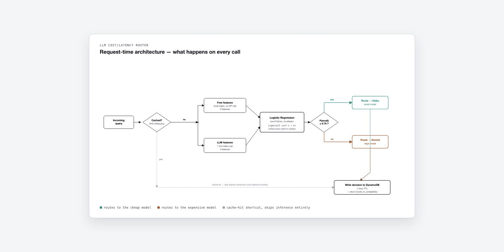
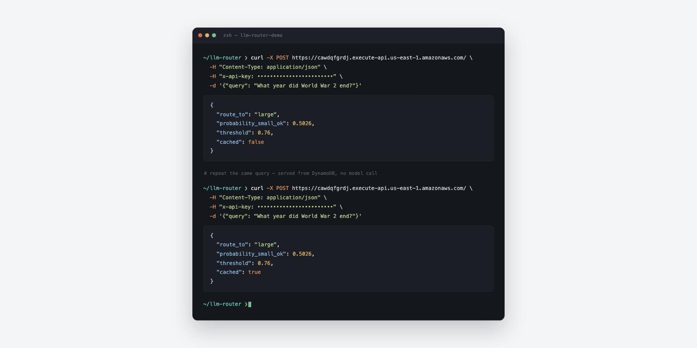

# LLM Cost/Latency Router

Predicts whether a cheap/fast LLM is "good enough" for a given query, or whether it needs
to be routed to a larger, more expensive model — **without calling either model first.**

**Complete and deployed.** [Read the full report](https://vledwardsjr.github.io/LLM-Router-Project/) · live API below · [`reports/final_report.md`](reports/final_report.md)

| | |
|---|---|
| **Cost savings** | 36.4% of traffic routed to the cheap model |
| **Quality impact** | +0.27 average (a net *gain*, not a loss) |
| **Worst-case risk** | Capped at 3 points of quality loss (vs. 7 with no routing at all) |
| **Total cost to build** | $10.21 in API spend + AWS pay-per-use (~free at this scale) |



## The Problem

Evaluating LLM outputs professionally means constantly making one judgment call: *is this
response good enough?* Watching that question play out at scale surfaces an expensive
pattern — most teams answer it by defaulting every query to the largest, most capable
model available. That's a safe answer, but it isn't a cheap one, and it isn't a
*designed* one. There's no principled, upfront decision about which queries actually need
the expensive model and which ones a cheap model would have handled just as well.

That's the gap this project targets: a way to make the cost-vs-quality tradeoff a
deliberate engineering decision instead of a default.

## The Approach

Instead of building another LLM, this builds a classical ML classifier that looks at a
query *before* either model is called and predicts whether the small/cheap model will be
sufficient. If a routing decision requires calling the expensive model to check whether
you needed the expensive model, it isn't saving anything — so every feature used here has
to be derivable from the query alone.

**Baselines it has to beat:**
- Always route to the large model → 100% quality, 0% cost savings.
- Always route to the small model → maximum savings, unknown quality loss.

The deliverable is a cost-savings-vs-quality-loss Pareto frontier — the business-facing
answer to "how much can we save without hurting quality" — plus a real-time endpoint that
acts on it.

## Try it live

```bash
curl -X POST https://cawdqfgrdj.execute-api.us-east-1.amazonaws.com/ \
  -H "Content-Type: application/json" \
  -H "x-api-key: <key>" \
  -d '{"query": "What is the capital of France?"}'
```

Requires an API key — a deliberate choice so a public URL can't be used to run up API
costs anonymously (available on request). Second identical request is served from the
DynamoDB cache with no model call:



## Findings worth knowing about

Three moments where the project surfaced a real result rather than a clean, expected one —
these are covered in depth in the [full report](reports/final_report.md):

- **A single train/test split made XGBoost look broken** (ROC-AUC 0.51, indistinguishable
  from random). 5-fold cross-validation revealed that was one unlucky fold — the real,
  CV-corrected picture is Logistic Regression winning on both performance (0.709 vs. 0.672
  mean ROC-AUC) *and* stability, given how few label=0 examples exist (68 of 900).
- **The "obvious" metric was the wrong one to optimize.** Average quality loss stays ≤ 0
  across the *entire* threshold range — even routing 100% of traffic to the cheap model
  doesn't hurt it on this dataset. The real, decision-useful signal turned out to be
  worst-case (max) quality loss instead, which drops from 7 points to 3 as the threshold
  tightens. That's the actual value the router provides: cutting tail-risk, not moving an
  average that was already fine.
- **No Docker meant no scikit-learn at runtime.** Deploying to AWS Lambda without a way to
  cross-compile scikit-learn for its Linux runtime forced a different design: the trained
  Logistic Regression's parameters were extracted and inference reimplemented as pure
  Python — verified to exactly match the original model's output (0.0 difference) across
  all 900 training rows before being trusted in production. Deployment package: 4.2MB.

## What Was Built

1. **Dataset construction** — 900 queries run through a small (Haiku) and large (Sonnet)
   model via the Anthropic Batch API, both outputs scored by an independent LLM-judge
   (Opus, to avoid self-preference bias), and the judge validated against a hand-scored
   sample before being trusted. 1,800 model calls + 1,800 judge calls, zero failures.
2. **Feature engineering** — 9 query-only signals (length, entity density, LLM-estimated
   reasoning-step count, ambiguity, domain, question type). A length-confound check caught
   and dropped 4 features that were secretly just re-encoding query length.
3. **Modeling** — Logistic Regression baseline vs. regularized XGBoost, compared honestly
   via 5-fold cross-validation (not a single split), plus SHAP feature importance.
4. **Threshold tuning & Pareto analysis** — Swept the classification threshold, computed
   cost savings vs. quality loss at each point using real judge scores, and picked an
   operating threshold justified by worst-case risk, not just the average.
5. **Deployment** — AWS Lambda (pure-Python inference) + API Gateway + DynamoDB, live,
   authenticated, and tested end-to-end against the real endpoint — including a manual
   test that surfaced a genuine out-of-distribution generalization limitation, documented
   rather than hidden.

## Tech Stack

| Area | Tools |
|---|---|
| Dataset construction | Python, pandas, pyarrow, Anthropic Batch API, structured outputs, LLM-as-judge |
| Feature engineering | pandas, NumPy, regex-based entity density, LLM-assisted extraction |
| Modeling | scikit-learn (Logistic Regression), XGBoost, SHAP, `StratifiedKFold` cross-validation |
| Threshold analysis | pandas, NumPy, matplotlib |
| Deployment | AWS Lambda (Python 3.11), API Gateway (HTTP API), DynamoDB, IAM, boto3 |

**Environment:** Python 3.11 (conda env `llm-router`), JupyterLab for notebooks.

## Project Structure

```
LLM-Router-Project/
├── data/                                  # datasets (gitignored — regenerated via the pipeline)
├── models/                                # trained model artifacts (gitignored)
├── notebooks/
│   ├── Phase 1/                           # dataset build, model runs, judge scoring/labeling
│   ├── 02_feature_engineering.ipynb
│   ├── 03_modeling_evaluation.ipynb
│   └── 04_threshold_pareto.ipynb
├── src/
│   ├── Phase 1/                           # dataset_building.py, run_models.py
│   ├── judge_labeling.py                  # LLM-judge scoring + label derivation
│   ├── extract_features.py                # feature engineering + length-confound check
│   ├── train_model.py                     # model training, evaluation, cross-validation
│   └── threshold_pareto.py                # Pareto frontier + threshold recommendation
├── deploy/
│   ├── lambda_handler.py                  # deployed Lambda code (pure-Python inference)
│   └── model_params.json                  # extracted model weights, verified against sklearn
├── reports/                                # final report, charts, evaluation artifacts
├── docs/                                   # GitHub Pages copy of the final report
├── requirements.txt
└── README.md
```

## Setup

```bash
pip install -r requirements.txt
```

Reproduce any phase by running its notebook or script — see the reproducibility table at
the end of [`reports/final_report.md`](reports/final_report.md) for the full
notebook/script/output mapping per phase.

## Engineering Principles

Carried forward from lessons on a prior evaluation project, applied here from day one
rather than discovered the hard way twice:

1. **Length confound check** — every candidate feature gets tested against raw query
   length before it's trusted as signal.
2. **Judge validation before trust** — LLM-generated labels are checked against a
   manually-scored sample for agreement before being used at scale.
3. **Business framing over raw accuracy** — the deliverable is the cost/quality Pareto
   curve, not a bare accuracy number — doubly true given a 92/8 label imbalance.
4. **Don't trust a single train/test split on a small dataset** — cross-validate before
   concluding one model beats another.
5. **Cloud tools chosen for fit, not familiarity** — DynamoDB for latency-critical key
   lookups, Lambda for the endpoint, each justified in the final report rather than
   defaulted to.

## Limitations

Stated plainly, not buried: a judge-validation correlation gate that technically fell
short of target, a Pareto result that's specific to this dataset's label distribution, and
an out-of-distribution generalization gap confirmed on the *live* deployed endpoint (a
genuinely hard technical query was misrouted with high confidence). Full detail, root
causes, and what a production deployment would need to change: [§6 of the final
report](reports/final_report.md#6-major-limitations-interview-ready-summary).
